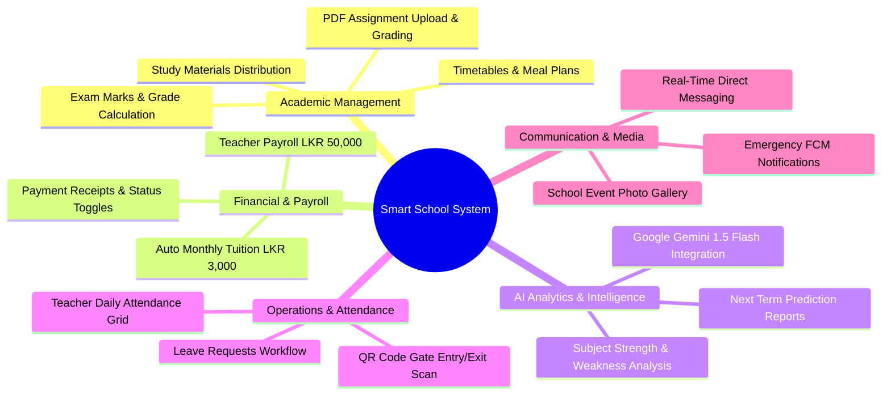

# 🏫 Smart School Management System (Elite International School)
## 📌 Complete Project Description & Functional Specification

---

## 🌟 Executive Overview

The **Smart School Management System** is a state-of-the-art, next-generation educational management platform built for **Elite International School**. It addresses the complex operational needs of modern K-12 educational institutions by integrating administrative governance, classroom management, financial accounting, student-parent engagement, and predictive AI analytics into a unified cloud-enabled ecosystem.

Powered by a high-performance **Laravel 12 REST API backend** and an intuitive **Flutter multi-role mobile application**, the system eliminates manual paperwork, automates monthly tuition billing, enforces strict data privacy across user roles, and equips students and parents with **Google Gemini AI-driven performance insights**.

---

## 🎯 Problem Statement & Solution

### The Challenge
Educational institutions traditional face operational bottlenecks:
* **Inefficient Attendance Tracking:** Manual roll calls consume valuable classroom instruction time and delay notification of student absences to parents.
* **Paper-Based Homework & Submissions:** physical assignments lead to misplaced homework, delayed feedback, and high paper consumption.
* **Complex Financial Administration:** Tracking monthly tuition fee payments (LKR 3,000/month) and teacher salary disbursements (LKR 50,000 base) across hundreds of students and staff manually is error-prone.
* **Lack of Predictive Insights:** Traditional report cards present past grades without analyzing student trends, subject weaknesses, or attendance correlations.
* **Fragmented Communication:** Messages, emergency alerts, and leave applications are scattered across SMS, emails, and physical circulars.

### The Smart School Solution
* **Instant QR Code Entry/Exit Logging:** Real-time gate scanning automatically records entry and exit timestamps.
* **Digital PDF Homework Submissions:** Direct in-app PDF uploading and digital grading with teacher feedback.
* **Automated Financial Engine:** Background job generation for monthly student tuition invoices and one-click payment status toggles.
* **Google Gemini AI Academic Counselor:** Instant predictive AI reports generated directly on the mobile app using historic exam marks and attendance metrics.
* **Unified Multi-Role Mobile Platform:** Dedicated, secure interfaces for **Administrators**, **Teachers**, **Students**, and **Parents**.

---

## 👥 Stakeholders & User Roles

| Role | Primary Objectives & Operational Scope |
| :--- | :--- |
| **🧑‍💼 School Administrator** | Oversees system configuration, manages staff and student accounts, assigns class teachers to grades, monitors overall attendance, controls monthly tuition billing, toggles teacher salary payments, issues emergency announcements, and manages leave requests. |
| **👨‍🏫 Teacher** | Manages assigned grade/class students, marks daily attendance, creates assignments, evaluates and grades student PDF submissions, inputs term exam marks, issues study materials, and communicates directly with parents and students. |
| **🧑‍🎓 Student** | Scans QR code for school entry/exit, views daily class timetables and meal plans, downloads study materials, submits homework via PDF, views exam results, pays tuition fees, and generates AI academic predictions. |
| **👨‍👩‍👧 Parent** | Monitors child’s real-time school gate attendance, reviews term report cards, tracks monthly tuition payment history, views school notices/events, communicates with teachers, and receives emergency alerts. |

---

## 🚀 Key Feature Modules & Functional Specifications



### 1. 🤖 AI Academic Analytics & Predictive Counseling
* **Engine:** Google Gemini 1.5 Flash API.
* **Functionality:** Aggregates a student’s historical exam scores, grade averages, and attendance percentages to build an AI prompt.
* **Output:**
  - Overall Academic Trajectory & Performance Summary.
  - Subject Strengths & Weaknesses Identification.
  - Impact Analysis of Attendance on Academic Marks.
  - Expected Grade Prediction for Upcoming Terms.
  - Actionable Recommendations for Students, Teachers, and Parents.

### 2. 📲 Real-Time QR Code Attendance Engine
* **Entry/Exit Logging:** Students present their unique dynamic QR code at the school gate scanner.
* **Automated Timestamps:** 
  - **First scan of the day:** Logs exact `entry_time` and sets status to `present`.
  - **Second scan of the day:** Logs exact `exit_time`.
* **Admin & Parent Visibility:** Parents and administrators receive real-time updates when a student enters or leaves school premises.

### 3. 💵 Automated Tuition Billing & Salary Management
* **Student Monthly Billing:** Auto-generates a monthly tuition fee invoice of **LKR 3,000.00** for all active students.
* **Teacher Salary Tracking:** Manages base salary disbursements (**LKR 50,000.00** default) for teaching staff.
* **Administrative Controls:** Admin dashboard provides one-tap toggles (`Paid` / `Unpaid`) for student fees and teacher salaries.

### 4. 📚 Homework, Subject Submissions & PDF Grading
* **PDF Upload System:** Students select subject assignments and upload response files in PDF format (validated up to 10MB).
* **Digital Evaluation Hub:** Teachers review submitted PDFs, assign numerical scores, and write feedback comments.
* **Automatic Grade Assignment:** System converts raw percentages into standard letter grades:
  - **A** ($\ge 75\%$) — Distinction
  - **B** ($65\% - 74\%$) — Very Good
  - **C** ($55\% - 64\%$) — Credit
  - **S** ($35\% - 54\%$) — Ordinary Pass
  - **F** ($< 35\%$) — Fail

### 5. 💬 Communication, Emergency Alerts & Leave Management
* **Direct Messaging:** Cross-role messaging allowing parents and students to chat with teachers and school administration.
* **Emergency Push Alerts:** Firebase Cloud Messaging (FCM) integration to broadcast critical alerts instantly to all mobile devices.
* **Leave Application Portal:** Teachers and students submit formal leave applications with date ranges and reasons; administrators review and respond with approval or rejection status.

### 6. 📅 Timetables, Meal Plans & Event Gallery
* **Dynamic Schedules:** Class timetables displayed by day and grade level.
* **Cafeteria Meal Plans:** Weekly breakdown of breakfast, lunch, and snack menus.
* **Event Photo Gallery:** High-resolution photo albums categorized by school events.

---

## 🔄 Real-World User Scenarios & Workflows

### Scenario 1: A Student's Daily Journey
1. **Morning Gate Arrival:** Student arrives at school and scans their QR code at the entrance kiosk. The system logs entry time (e.g., `07:45 AM`) and sets attendance to `Present`.
2. **Classroom & Timetable:** Student checks their Flutter app timetable to view today’s subjects (Mathematics, Science, English).
3. **Homework Submission:** During study period, student uploads their completed Mathematics assignment as a PDF file.
4. **Exam Results & AI Prediction:** After term marks are published, the student taps "AI Prediction". The Flutter app calls Google Gemini 1.5 Flash to generate a detailed report predicting their final national exam results and highlighting areas for improvement.
5. **Afternoon Departure:** Student scans their QR code at departure. The system records `exit_time` (e.g., `01:45 PM`).

### Scenario 2: A Teacher's Classroom Management
1. **Login & Role Scope:** Teacher logs into the Flutter app; the system filters data to display only students belonging to their assigned Grade (e.g., Grade 10-A).
2. **Marks Input:** Teacher enters raw marks for Term 1 Mid Exams. The backend automatically calculates percentage and assigns letter grades (A, B, C, S, F).
3. **Assignment Review:** Teacher views uploaded student PDFs, enters scores, provides text feedback, and publishes grades to student portals.

### Scenario 3: Administrative Governance
1. **Financial Overview:** Admin opens the web/mobile dashboard to inspect the monthly fee status overview.
2. **Salary & Fee Toggling:** Admin marks tuition fees collected at the cash counter as `Paid` and updates teacher salary disbursement records.
3. **Emergency Notification:** Admin broadcasts an emergency alert regarding school closure due to heavy rainfall; all parents receive an instant push notification on their phones.

---

## 🏗️ Technical Architecture & Infrastructure Overview

```
┌─────────────────────────────────────────────────────────────────┐
│                    MOBILE APP (Flutter Client)                  │
│   • Admin Portal   • Teacher Hub   • Student Portal   • Parent  │
└───────────────────────────────┬─────────────────────────────────┘
                                │  HTTPS REST API (JWT Tokens)
                                ▼
┌─────────────────────────────────────────────────────────────────┐
│                   LARAVEL 12 BACKEND SERVER                     │
│   • Auth & Middleware   • Controllers   • Eloquent ORM Models   │
│   • Local Storage Disk  • Auto Billing  • Data Isolation Scope  │
└───────────────────────────────┬─────────────────────────────────┘
                                │  MySQL Connection
                                ▼
┌─────────────────────────────────────────────────────────────────┐
│                 REMOTE MYSQL DATABASE (StackCP)                 │
│   Host: sdb-l.hosting.stackcp.net  | Database: smart_school    │
└─────────────────────────────────────────────────────────────────┘
```

---

## 🔒 Security & Data Governance Standards

* **Stateless Authentication:** JSON Web Token (JWT) architecture with automated expiration and refresh capabilities.
* **Data Isolation Policies:** Strict controller-level scope restrictions preventing teachers from accessing student records outside their assigned grade.
* **Encrypted Passwords:** Passwords hashed using Bcrypt (12 cost factor rounds).
* **Sanitized File Uploads:** Uploaded assignments restricted to PDF format with 10MB payload size validation.

---

*Document created for Smart School Management System — Elite International School.*  
*Backend Engine: Laravel 12 | Mobile Client: Flutter | AI Analytics: Google Gemini API*
