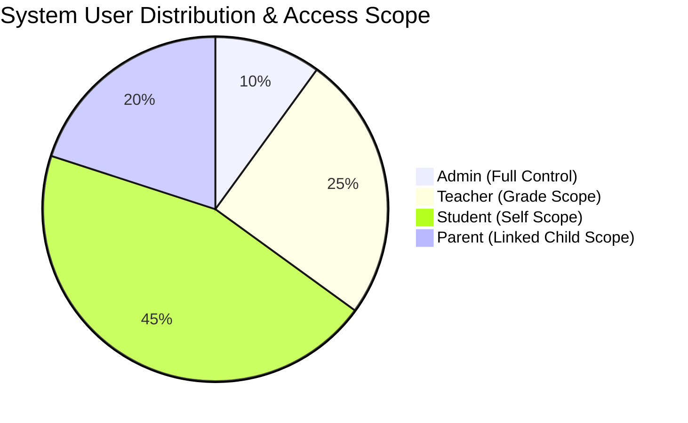
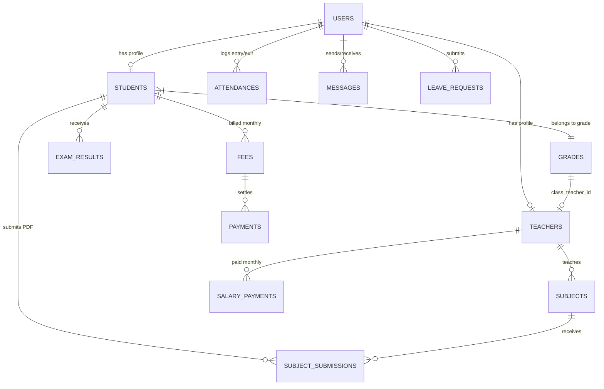
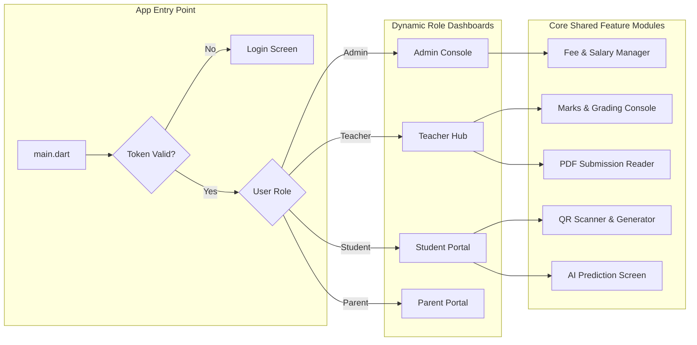
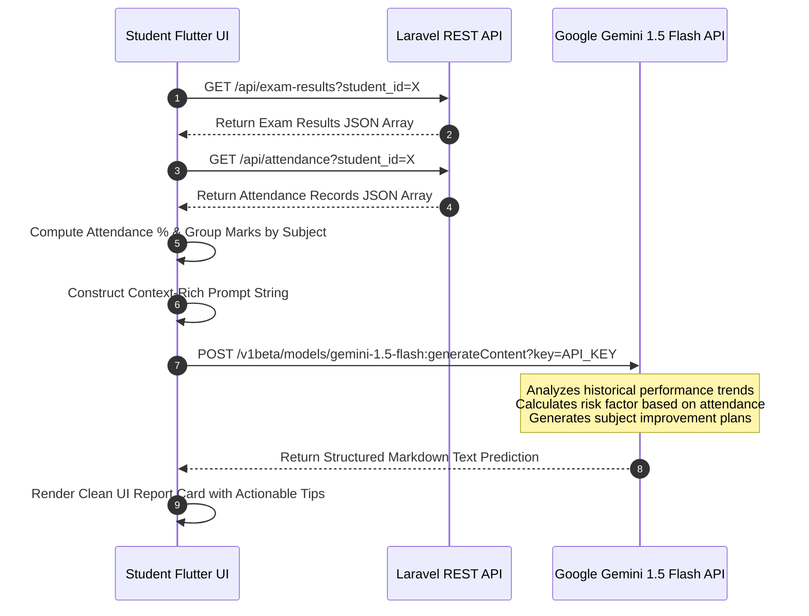

# 📚 Smart School Management System — Comprehensive Enterprise System Architecture & Technical Specification

> **System Name:** Elite International School Management Platform  
> **Live Production Server:** `https://eliteinternationalschool.live`  
> **API Base URL:** `https://eliteinternationalschool.live/api`  
> **Architecture Pattern:** Decoupled RESTful API Backend + Multi-Role Flutter Mobile Client + Google Gemini AI Analytics Engine  
> **Detailed Functional Description:** [PROJECT_DESCRIPTION.md](file:///e:/Flutter%20my/Flutter/Narme/smart-school-backend/PROJECT_DESCRIPTION.md)

---

## 📑 Table of Contents
1. [Executive Summary & System Overview](#1-executive-summary--system-overview)
2. [High-Level System Architecture](#2-high-level-system-architecture)
3. [Technology Stack Matrix](#3-technology-stack-matrix)
4. [User Roles & Security Permissions](#4-user-roles--security-permissions)
5. [Authentication & Authorization Subsystem (JWT)](#5-authentication--authorization-subsystem-jwt)
6. [Complete Database Schema & Entity Relationships](#6-complete-database-schema--entity-relationships)
7. [Comprehensive API Endpoint Specifications](#7-comprehensive-api-endpoint-specifications)
8. [Mobile Application Architecture (Flutter 4-in-1 Client)](#8-mobile-application-architecture-flutter-4-in-1-client)
9. [Artificial Intelligence Engine Integration (Google Gemini API)](#9-artificial-intelligence-engine-integration-google-gemini-api)
10. [Core Business Logic & Automated Workflows](#10-core-business-logic--automated-workflows)
11. [Installation, Configuration & Deployment Guide](#11-installation-configuration--deployment-guide)
12. [Security, Performance & Operational Standards](#12-security-performance--operational-standards)

---

## 1. Executive Summary & System Overview

The **Smart School Management System (Elite International School)** is a modern, enterprise-grade educational management ecosystem. Designed to replace legacy paperwork and disjointed software, the system unifies administrative operations, academic tracking, financial accounting, parent-teacher communication, and student analytics into a single cohesive platform.

### Core Capabilities
- **Multi-Role Mobile Client (Flutter):** Provides custom tailored interfaces for **Admins**, **Teachers**, **Students**, and **Parents**.
- **RESTful API Backend (Laravel 12):** High-performance, stateless PHP 8.2 backend utilizing JWT authentication for micro-latency data delivery.
- **Predictive AI Engine (Google Gemini 1.5 Flash):** Evaluates multi-term academic results, subject trends, and attendance statistics to generate personalized student performance predictions and actionable guidance.
- **Automated Financial Engine:** Handles recurring student tuition billing (LKR 3,000/mo), payment tracking, and teacher salary distribution (LKR 50,000 base).
- **QR Code Attendance System:** Real-time check-in and check-out tracking via mobile scanning with automatic timestamp logging.
- **Digital Classroom Management:** PDF assignment submissions, teacher grading workflows, timetables, meal planning, emergency push notifications, and direct messaging.

---

## 2. High-Level System Architecture

The ecosystem relies on a three-tier decoupled architecture:

```mermaid
graph TD
    subgraph Client Layer [Mobile Application - Flutter Dart]
        AdminApp[Admin Interface]
        TeacherApp[Teacher Interface]
        StudentApp[Student Interface]
        ParentApp[Parent Interface]
    end

    subgraph Security & API Gateway
        JWTAuth[JWT Bearer Middleware]
        CORS[CORS / Rate Limiter]
    end

    subgraph Application Server [Laravel 12 REST API]
        AuthCtrl[Auth Controller]
        AdminCtrl[Admin Controller]
        StudentCtrl[Student Controller]
        ExamCtrl[Exam & Results Controller]
        FeeCtrl[Financial & Salary Controller]
        AttCtrl[Attendance Controller]
        NoticeCtrl[Notices & Emergency Alerts]
        ChatCtrl[Messaging & Complaints]
    end

    subgraph Data & External Services
        MySQLDB[(Remote MySQL DB - stackcp.net)]
        LocalStorage[Public Storage Disk - File Uploads]
        GeminiAI[Google Gemini 1.5 Flash API]
    end

    Client Layer -->|HTTPS / JSON + Bearer Token| Security & API Gateway
    Security & API Gateway --> Application Server
    Application Server <-->|Eloquent ORM| MySQLDB
    Application Server <-->|PDF / Images| LocalStorage
    StudentApp -->|Direct HTTPS Request| GeminiAI
    TeacherApp -->|Direct HTTPS Request| GeminiAI
```

---

## 3. Technology Stack Matrix

| Layer | Technology / Package | Description & Version |
| :--- | :--- | :--- |
| **Backend Framework** | Laravel Framework | Version `12.x` (PHP `^8.2`) |
| **Authentication** | `tymon/jwt-auth` | Version `^2.2` JSON Web Token Authentication |
| **Database Server** | MySQL | Remote hosted DB (`smart_school-3139321905`) |
| **Database Host** | StackCP Infrastructure | Host: `sdb-l.hosting.stackcp.net` |
| **Mobile Framework** | Flutter / Dart | Cross-platform (iOS & Android) single codebase |
| **AI Processing** | Google Gemini API | `gemini-1.5-flash` for automated student prediction |
| **Networking Client** | HTTP / Dio (Flutter) | RESTful API Client with Bearer Token interceptors |
| **Push Notifications** | Firebase Cloud Messaging (FCM) | Real-time emergency notifications & alerts |
| **File Storage** | Laravel Local Storage Disk | Public disk (`storage/app/public`) with symlink |
| **Asset Storage** | Digital PDF / Images | Student assignment PDFs, gallery pictures |

---

## 4. User Roles & Security Permissions

The system enforces strict **Role-Based Access Control (RBAC)** across 4 user profiles:



### Access Matrix

| Feature / Module | Admin | Teacher | Student | Parent |
| :--- | :---: | :---: | :---: | :---: |
| **User & Staff Management** | 🟢 Create/Edit/Delete | 🔴 No Access | 🔴 No Access | 🔴 No Access |
| **Grade & Class Assignment** | 🟢 Full Access | 🟡 Assigned Grade | 🔵 View Only | 🔵 View Only |
| **Attendance Tracking** | 🟢 View All | 🟢 Mark Assigned Class | 🔵 View Own | 🔵 View Child |
| **QR Code Scan Entry/Exit** | 🟢 Monitor | 🟢 Mark | 🟢 Scan In/Out | 🔴 No Access |
| **Exam Results & Grading** | 🟢 Overrule | 🟢 Enter & Edit Marks | 🔵 View Own | 🔵 View Child |
| **AI Performance Report** | 🟢 Generate | 🟢 Generate | 🟢 Generate Own | 🟢 Generate Child |
| **Tuition Fee Management** | 🟢 Toggle Status | 🔴 No Access | 🔵 View Status | 🔵 Pay & View |
| **Teacher Salary Control** | 🟢 Toggle/Update | 🔵 View Own History | 🔴 No Access | 🔴 No Access |
| **Assignment Upload (PDF)** | 🟢 Manage | 🟢 Create & Grade | 🟢 Upload PDF | 🔵 View Submissions |
| **Leave Request Approval** | 🟢 Approve/Reject | 🟢 Submit Request | 🟢 Submit Request | 🔴 No Access |
| **Direct Messaging** | 🟢 All Users | 🟢 Students/Parents | 🟢 Teachers/Admin | 🟢 Teachers/Admin |

---

## 5. Authentication & Authorization Subsystem (JWT)

Authentication is completely stateless using **JSON Web Tokens (JWT)** issued by the backend upon credential validation.

### Authentication Flow Sequence

```mermaid
sequenceDiagram
    autonumber
    participant Mobile as Flutter App
    participant Auth as AuthController
    participant Middleware as auth:api Middleware
    participant Controller as Resource Controller

    Mobile->>Auth: POST /api/login (email, password)
    Auth->>Auth: Verify Bcrypt Hash
    alt Credentials Valid
        Auth-->>Mobile: Return HTTP 200 { token, role, user_data }
        Mobile->>Mobile: Save JWT to Secure Storage
    else Credentials Invalid
        Auth-->>Mobile: Return HTTP 401 { error: "Unauthorized" }
    end

    Note over Mobile, Controller: Subsequent Protected API Requests
    Mobile->>Middleware: GET /api/me (Header: Authorization Bearer <token>)
    Middleware->>Middleware: Validate Token Expiry & Signature
    alt Valid Token
        Middleware->>Controller: Forward Request with Authenticated User Context
        Controller-->>Mobile: HTTP 200 OK + Payload
    invalid Expired / Modified Token
        Middleware-->>Mobile: HTTP 401 Token Expired / Invalid
    end
```

---

## 6. Complete Database Schema & Entity Relationships

The MySQL database contains **31 migration tables** and **26 Eloquent Models**. Below are the primary entities and their field specifications.

### 6.1 Entity Relationship Diagram (ERD)



### 6.2 Primary Database Tables Specification

#### 1. `users`
Stores login credentials and profile metadata for all user types.
* `id` (PK, BigInt, Auto-increment)
* `name` (Varchar 255)
* `email` (Varchar 255, Unique)
* `password` (Varchar 255, Bcrypt hashed)
* `role` (Enum: `'admin'`, `'teacher'`, `'student'`, `'parent'`)
* `phone` (Varchar 50, Nullable)
* `address` (Text, Nullable)
* `profile_picture` (Varchar 255, Nullable)
* `fcm_token` (Text, Nullable - Firebase Cloud Messaging token)
* `created_at`, `updated_at` (Timestamps)

#### 2. `students`
Extended academic profile for student accounts.
* `id` (PK, BigInt, Auto-increment)
* `user_id` (FK -> `users.id`, On Delete Cascade)
* `student_id` (Varchar 50, Unique, e.g., `STU00005`)
* `grade` (Varchar 50, e.g., `'10'`)
* `class` (Varchar 10, e.g., `'A'`)
* `parent_id` (FK -> `users.id`, Nullable)
* `date_of_birth` (Date, Nullable)
* `gender` (Enum: `'male'`, `'female'`, `'other'`)
* `emergency_contact` (Varchar 50, Nullable)

#### 3. `teachers`
Professional details and salary info for teaching staff.
* `id` (PK, BigInt, Auto-increment)
* `user_id` (FK -> `users.id`, On Delete Cascade)
* `teacher_id` (Varchar 50, Unique, e.g., `TCH001`)
* `subject_specialization` (Varchar 255)
* `qualification` (Varchar 255)
* `assigned_grade` (Varchar 50, Nullable)
* `assigned_class` (Varchar 10, Nullable)
* `basic_salary` (Decimal 10,2, Default: `50000.00`)

#### 4. `grades`
Grade level configurations and class teacher assignments.
* `id` (PK, BigInt, Auto-increment)
* `name` (Varchar 50, e.g., `'Grade 10'`)
* `class_teacher_id` (FK -> `teachers.id`, Nullable)

#### 5. `attendances`
Timestamped QR attendance entry and exit logs.
* `id` (PK, BigInt, Auto-increment)
* `user_id` (FK -> `users.id`, On Delete Cascade)
* `date` (Date)
* `entry_time` (Time, Nullable)
* `exit_time` (Time, Nullable)
* `status` (Enum: `'present'`, `'absent'`, `'late'`, `'leave'`)

#### 6. `exam_results`
Individual term marks and automatic letter grades.
* `id` (PK, BigInt, Auto-increment)
* `student_id` (FK -> `students.id`, On Delete Cascade)
* `subject_id` (FK -> `subjects.id`, On Delete Cascade)
* `exam_name` (Varchar 255)
* `marks_obtained` (Decimal 5,2)
* `total_marks` (Decimal 5,2, Default: `100.00`)
* `percentage` (Decimal 5,2)
* `grade` (Varchar 5, Calculated: `'A'`, `'B'`, `'C'`, `'S'`, `'F'`)
* `term` (Varchar 50, e.g., `'Term 1'`)
* `academic_year` (Integer, e.g., `2026`)

#### 7. `fees` & `payments`
Automated tuition records and settlement transactions.
* **`fees`**: `id`, `student_id`, `month` (Varchar), `year` (Integer), `amount` (Decimal 10,2, Default: `3000.00`), `status` (`'paid'`, `'unpaid'`), `due_date` (Date)
* **`payments`**: `id`, `fee_id`, `student_id`, `amount`, `payment_method`, `transaction_id`, `payment_date`

#### 8. `salary_payments`
Teacher payroll tracking.
* `id`, `teacher_id`, `month`, `year`, `amount` (Default: `50000.00`), `status` (`'paid'`, `'unpaid'`), `payment_date`

#### 9. `subjects` & `subject_submissions`
Assignment upload management.
* **`subjects`**: `id`, `name`, `code`, `grade`, `teacher_id`, `due_time`, `due_date`
* **`subject_submissions`**: `id`, `subject_id`, `student_id`, `file_path` (PDF file location), `marks`, `feedback`, `submitted_at`

---

## 7. Comprehensive API Endpoint Specifications

All endpoints return structured JSON standard responses. Protected routes require HTTP Header `Authorization: Bearer <jwt_token>`.

### 7.1 Authentication Endpoints (`/api`)

| Method | Endpoint | Description | Auth Required |
| :--- | :--- | :--- | :---: |
| `POST` | `/api/register` | Register new user account | ❌ |
| `POST` | `/api/login` | Validate user & issue JWT token | ❌ |
| `POST` | `/api/logout` | Invalidate current token | ✅ |
| `GET` | `/api/me` | Fetch logged-in user profile details | ✅ |
| `POST` | `/api/refresh` | Refresh expired JWT token | ✅ |
| `POST` | `/api/user-details` | Fetch specific user details | ❌ |
| `POST` | `/api/user/fcm-token` | Update user Firebase Push token | ✅ |

### 7.2 Student & Academic Endpoints

| Method | Endpoint | Description | Auth Required |
| :--- | :--- | :--- | :---: |
| `GET` | `/api/students/{id}/dashboard` | Retrieve complete student summary dashboard | ✅ |
| `GET` | `/api/students/{id}/attendance` | Fetch attendance history for a student | ✅ |
| `GET` | `/api/students/{id}/timetable` | Get timetable for student's class | ✅ |
| `GET` | `/api/students/{id}/results` | Fetch all term exam results for a student | ✅ |
| `GET` | `/api/students/{id}/payments` | Get tuition fee payment history | ✅ |

### 7.3 Exam Results & Grading Endpoints

| Method | Endpoint | Description | Auth Required |
| :--- | :--- | :--- | :---: |
| `GET` | `/api/exam-results` | List all exam results (Filtered by role scope) | ✅ |
| `POST` | `/api/exam-results` | Insert new exam mark record | ✅ |
| `GET` | `/api/exam-results/{id}` | Get single result detail | ✅ |
| `PUT` | `/api/exam-results/{id}` | Update existing result marks | ✅ |
| `DELETE` | `/api/exam-results/{id}` | Delete exam result entry | ✅ |
| `GET` | `/api/exam-results/student/{studentId}/{academicYear}` | Generate full report card data | ✅ |

### 7.4 Attendance & QR Scan Endpoints

| Method | Endpoint | Description | Auth Required |
| :--- | :--- | :--- | :---: |
| `GET` | `/api/attendance` | List attendance records | ✅ |
| `POST` | `/api/attendance` | Manual attendance logging | ✅ |
| `POST` | `/api/attendance/mark-qr` | QR scan processing (Auto Entry/Exit timestamp) | ✅ |
| `POST` | `/api/attendence/mark` | Legacy quick mark endpoint | ❌ |
| `POST` | `/api/attendence/user` | Fetch attendance history by user | ❌ |

### 7.5 Financial & Payroll Endpoints

| Method | Endpoint | Description | Auth Required |
| :--- | :--- | :--- | :---: |
| `GET` | `/api/fees` | List tuition fees (Auto-creates missing monthly fees) | ✅ |
| `POST` | `/api/fees` | Create custom fee item | ✅ |
| `POST` | `/api/fees/pay` | Record student payment transaction | ✅ |
| `GET` | `/api/payments/student/{student_id}` | Fetch payment breakdown per student | ✅ |
| `POST` | `/api/admin/students/{id}/toggle-fee/{fee_id}` | Toggle fee paid/unpaid status (Admin) | ✅ |
| `GET` | `/api/admin/fees/monthly-status` | Comprehensive monthly fee overview | ✅ |
| `GET` | `/api/admin/salaries/monthly-status` | Monthly teacher payroll overview | ✅ |
| `POST` | `/api/admin/salaries/toggle` | Toggle teacher salary payment status | ✅ |
| `GET` | `/api/teacher/salaries` | Teacher self-service salary history | ✅ |

### 7.6 Subjects & PDF Submissions Endpoints

| Method | Endpoint | Description | Auth Required |
| :--- | :--- | :--- | :---: |
| `GET` | `/api/subjects` | List subjects | ❌ |
| `POST` | `/api/subjects` | Add new subject with due dates | ❌ |
| `PUT` | `/api/subjects/{id}` | Update subject details | ❌ |
| `DELETE` | `/api/subjects/{id}` | Remove subject | ❌ |
| `POST` | `/api/subject-submissions` | Upload student PDF assignment | ❌ |
| `GET` | `/api/subject-submissions` | List submitted assignment PDFs | ❌ |
| `PUT` | `/api/subject-submissions/{id}/grade` | Grade student submission with marks & feedback | ❌ |

### 7.7 Administration & System Control Endpoints

| Method | Endpoint | Description | Auth Required |
| :--- | :--- | :--- | :---: |
| `GET` | `/api/admin/users` | Retrieve all registered users | ✅ |
| `POST` | `/api/admin/users` | Create new user account (Admin) | ✅ |
| `PUT` | `/api/admin/users/{id}` | Update user profile | ✅ |
| `DELETE` | `/api/admin/users/{id}` | Remove user | ✅ |
| `PUT` | `/api/admin/users/{id}/password` | Reset user password | ✅ |
| `GET` | `/api/admin/teachers` | List all teaching staff | ✅ |
| `PUT` | `/api/admin/teachers/{id}` | Update teacher details & assignment | ✅ |
| `GET` | `/api/admin/grades` | List grades (Auto-initializes Grades 1–12) | ✅ |
| `PUT` | `/api/admin/grades/{id}/assign-teacher` | Assign class teacher to grade | ✅ |

---

## 8. Mobile Application Architecture (Flutter 4-in-1 Client)

The mobile application is crafted in **Flutter (Dart)** and operates as a unified client that adapts dynamically based on the authenticated user's role (`admin`, `teacher`, `student`, `parent`).



### Key UI Features per Profile
1. **Student Hub:**
   - Visual dashboard displaying subject averages, attendance percentage, upcoming assignments, and fee status.
   - Dynamic QR scanner for scanning gate codes during entry and exit.
   - **AI Analytics Screen:** Generates real-time performance insights powered by Google Gemini.
   - PDF upload button for uploading homework directly from local device storage.
2. **Teacher Console:**
   - Filtered view displaying only students in their assigned Grade/Class.
   - Quick attendance grid to mark present/absent.
   - Marks entry form with auto grade calculator (A/B/C/S/F).
   - Digital PDF reviewer to evaluate assignment submissions and write feedback.
3. **Admin Portal:**
   - School-wide metric cards (total revenue, uncollected fees, total staff, overall attendance).
   - One-tap toggle buttons for toggling tuition fees and teacher payroll status.
   - Emergency Push Notification broadcaster.
4. **Parent Portal:**
   - Single-screen overview of child's real-time school entry/exit timestamps.
   - Examination report card viewer.
   - Tuition payment gateway status.

---

## 9. Artificial Intelligence Engine Integration (Google Gemini API)

The mobile app integrates **Google Gemini 1.5 Flash API** to deliver AI academic predictions. Rather than sending raw prompt text, the application aggregates multi-source backend data (exam marks, attendance stats, term trends) and builds a structured prompt for the model.

### 9.1 Data Flow Sequence



### 9.2 Complete Flutter Implementation Code

#### 1. Gemini Service Provider (`lib/services/gemini_service.dart`)

```dart
import 'dart:convert';
import 'package:http/http.dart' as http;

class GeminiService {
  static const String _apiKey = 'YOUR_GEMINI_API_KEY_HERE';
  static const String _baseUrl =
      'https://generativelanguage.googleapis.com/v1beta/models/gemini-1.5-flash:generateContent';

  /// Generates academic performance prediction and guidance report
  static Future<String> predictStudentPerformance({
    required String studentName,
    required String grade,
    required List<Map<String, dynamic>> examResults,
    required int attendancePercentage,
  }) async {
    // 1. Format raw exam results into structured prompt text
    String resultsSummary = examResults.map((r) {
      final subject = r['subject'] != null ? r['subject']['name'] : r['subject_name'] ?? 'Subject';
      final marks = r['marks_obtained'];
      final total = r['total_marks'] ?? 100;
      final gradeVal = r['grade'] ?? 'N/A';
      final term = r['term'] ?? 'Term';
      return '- $subject: $marks/$total (Grade: $gradeVal, $term)';
    }).join('\n');

    // 2. Formulate engineered prompt
    String prompt = '''
You are an elite educational data analyst and academic counselor.
Analyze the following student performance data and generate a comprehensive performance analysis report.

=== STUDENT PROFILE ===
- Name: $studentName
- Grade/Level: $grade
- Overall Attendance Rate: $attendancePercentage%

=== RECENT EXAM RESULTS ===
$resultsSummary

=== REQUIRED REPORT STRUCTURE ===
1. 📊 PERFORMANCE OVERVIEW: Synthesize current academic trajectory.
2. 🌟 KEY STRENGTHS: Highlight subjects where student performs exceptionally.
3. ⚠️ TARGET AREAS FOR IMPROVEMENT: Identify weak subjects needing focused revision.
4. ⏱️ ATTENDANCE CORRELATION: Explain how attendance ($attendancePercentage%) impacts these marks.
5. 🔮 NEXT TERM PREDICTION: Predict expected grade tier if current trajectory continues.
6. 🎯 STRATEGIC RECOMMENDATIONS: Provide 3 actionable advice items for student & parents.

Keep the response constructive, clear, encouraging, and highly professional. Format with Markdown.
''';

    try {
      final response = await http.post(
        Uri.parse('$_baseUrl?key=$_apiKey'),
        headers: {'Content-Type': 'application/json'},
        body: jsonEncode({
          'contents': [
            {
              'parts': [
                {'text': prompt}
              ]
            }
          ],
          'generationConfig': {
            'temperature': 0.6,
            'maxOutputTokens': 1200,
          }
        }),
      );

      if (response.statusCode == 200) {
        final data = jsonDecode(response.body);
        return data['candidates'][0]['content']['parts'][0]['text'];
      } else {
        return 'Unable to generate AI prediction at this time. (Error Code: ${response.statusCode})';
      }
    } catch (e) {
      return 'Connection error while communicating with AI service: $e';
    }
  }
}
```

---

## 10. Core Business Logic & Automated Workflows

### 10.1 Automatic Grade Calculation Rule
Marks uploaded via `/api/exam-results` automatically trigger letter grade assignment prior to saving:

$$\text{Percentage} = \left( \frac{\text{Marks Obtained}}{\text{Total Marks}} \right) \times 100$$

| Percentage Range | Letter Grade | Academic Interpretation |
| :--- | :---: | :--- |
| $\ge 75\%$ | **A** | Distinction / Excellent |
| $65\% - 74\%$ | **B** | Very Good / Very Satisfactory |
| $55\% - 64\%$ | **C** | Credit / Satisfactory |
| $35\% - 54\%$ | **S** | Ordinary Pass / Needs Improvement |
| $< 35\%$ | **F** | Fail / Immediate Remedial Action Required |

### 10.2 Automated Monthly Tuition Fee Engine
To avoid manual monthly billing creation, calling `GET /api/fees` executes an auto-billing loop in `FeeController.php`:
1. System queries all active student records.
2. Checks current year and month against existing fee records in `fees` table.
3. Automatically generates an un-paid fee entry of **LKR 3,000.00** for any missing months up to the upcoming month.
4. Admins can toggle paid/unpaid status with a single API call (`POST /api/admin/students/{id}/toggle-fee/{fee_id}`).

### 10.3 QR Code Attendance Scanning Logic
1. When a student scans their digital ID card QR code at the entrance, Flutter posts to `/api/attendance/mark-qr`.
2. Controller checks if an attendance record exists for the student on today's date:
   - **First Scan of the Day:** Creates record, sets `entry_time = NOW()`, sets `status = 'present'`.
   - **Second Scan of the Day:** Updates existing record, sets `exit_time = NOW()`.

### 10.4 Teacher Data Isolation Enforcement
To guarantee privacy and security:
- Controller methods check `if (auth()->user()->role === 'teacher')`.
- Queries are automatically filtered by `assigned_grade` and `assigned_class` stored in the teacher's profile.
- Teachers are strictly prohibited from viewing or modifying marks, attendance, or profiles of students outside their assigned jurisdiction.

---

## 11. Installation, Configuration & Deployment Guide

### 11.1 Backend Prerequisites
- PHP `^8.2` with extensions: `pdo_mysql`, `openssl`, `mbstring`, `fileinfo`, `tokenizer`, `xml`.
- Composer dependency manager (`v2.x`).
- MySQL Server (`v8.0+` or MariaDB).

### 11.2 Environment Setup Steps

```bash
# 1. Clone repository
git clone https://github.com/your-org/smart-school-backend.git
cd smart-school-backend

# 2. Install PHP composer packages
composer install --no-dev --optimize-autoloader

# 3. Environment configuration
cp .env.example .env

# Configure .env parameters:
# DB_HOST=sdb-l.hosting.stackcp.net
# DB_DATABASE=smart_school-3139321905
# DB_USERNAME=your_db_username
# DB_PASSWORD=your_db_password

# 4. Generate Application Key & JWT Secret Key
php artisan key:generate
php artisan jwt:secret

# 5. Execute Database Migrations
php artisan migrate --force

# 6. Create Storage Symlink for Public Assets
php artisan storage:link

# 7. Serve Locally
php artisan serve
```

---

## 12. Security, Performance & Operational Standards

| Aspect | Standard / Implementation Detail |
| :--- | :--- |
| **Data Transmission** | Enforced HTTPS / SSL TLS 1.3 encryption across production endpoints. |
| **Password Storage** | Bcrypt hashing algorithm with a default cost factor of 12 rounds. |
| **Session Model** | Completely stateless REST architecture; tokens expire after configurable TTL. |
| **Upload Sanitization** | Assignment submissions strictly validated: PDF extension only, max limit 10MB. |
| **CORS Policy** | Whitelisted headers with explicit origin verification in `config/cors.php`. |
| **Database Protection** | Prepared SQL queries via Laravel Eloquent ORM to prevent SQL Injection. |

---

*Document compiled and finalized for Smart School Management System — Elite International School.*  
*Backend Stack: Laravel 12 / PHP 8.2 | Mobile Stack: Flutter / Dart | Intelligence Engine: Google Gemini API*
